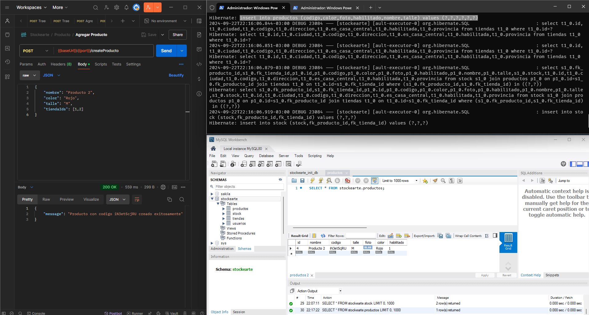

# Desarrollo de Software en Sistemas Distribuidos

Este trabajo consiste en las tres entregas (TP1 - Grpc, TP2 - Kafka, TP3 - API REST/SOAP)

### Integrantes del Grupo 2

- Andrés Ezequiel Cupo
- Mauro Bazante
- Sergio Simón Robles Flores
- Valentín Olivero

## Demo de la entrega 1 utilizando gRPC:
[https://youtu.be/m7Y2N5eE9b4](https://youtu.be/m7Y2N5eE9b4)
## Demo de la entrega 2 utilizando Kafka:
[https://youtu.be/N_nWzSGu-gg](https://youtu.be/N_nWzSGu-gg)
## Demo de la entrega 3 utilizando API REST/SOAP:
[https://youtu.be/wozt1URqeyE](https://youtu.be/wozt1URqeyE)

## Link al repositorio:

[https://github.com/maubazante/RPC-Grupo2](https://github.com/maubazante/RPC-Grupo2)

### Cómo Clonar el Repositorio

Para clonar este repositorio, utilizar el siguiente comando en la terminal o consola:

```bash
git clone https://github.com/maubazante/RPC-Grupo2.git
```

# Enunciado

Utilizando gRPC, generar un sistema que cumpla los requerimientos más abajo detallados, mediante el siguiente esquema:

1. Una interfaz web para operar con el sistema.
2. Un controlador que recibirá las peticiones de la vista, llamando a los servicios correspondientes según el caso:  
   a. **Usuarios:** creación, autenticación.  
   b. **Tiendas:** creación, inhabilitación, asignación de productos, asignación de usuarios.  
   c. **Productos:** creación, modificación, eliminación, búsqueda: listado y detalle.  

Dichos servicios son independientes, y tanto la parte cliente como la parte servidor deben ser desarrolladas en lenguajes diferentes. Por ejemplo: cliente en C# y servidor en Python, etc.

## Requerimientos

**Stockearte** es un sistema web de gestión de stock para cadenas comercializadoras de indumentaria. Las cadenas cuentan con una casa central y pueden tener una o varias tiendas distribuidas en el país, las cuales pueden manejar su propio stock y comercializar diferentes productos.

### 1) Conociendo cuál es la operación principal del sitio, se nos indica el siguiente backlog de tareas:  
a. Como usuario de casa central, quiero dar de alta tiendas o eliminarlas. Tengo que poder identificarlas unívocamente por un código alfanumérico elegido por mí. Además, debe tener datos de dirección, ciudad, provincia y un check para habilitarla o deshabilitarla.

b. Como usuario de casa central, quiero dar de alta usuarios para asignarlos a tiendas. Cada usuario cuenta con un nombre de usuario, una contraseña, la tienda a la que pertenece (solo puede pertenecer a una tienda o a casa central), nombre, apellido, habilitado/deshabilitado.

c. Como usuario de casa central, quiero dar de alta productos para asignarlos a una o varias tiendas a la vez. Cada producto cuenta con los siguientes datos: nombre, código único (de 10 caracteres generados al azar), talle, foto, color y stock. El stock se registra por color y talle, es manejado por cada tienda, por lo que este dato en el alta se fija a 0 por defecto.

d. Como usuario de tienda, quiero modificar el stock de los productos que tiene asignados mi tienda.

### 2) Búsquedas

a. **Usuarios** (solo disponible para usuarios de casa central): se pueden filtrar por nombre de usuario y/o tienda.

b. **Tiendas** (solo disponible para usuarios de casa central): se pueden filtrar por código y/o estado (habilitada/deshabilitada).

c. **Productos:** se pueden filtrar por nombre, código, talle, color.  

### 3) Listados: Los resultados varían según el tipo de usuario que realice la búsqueda:

a. **Productos:** para usuarios de casa central, se muestran en los listados todos los resultados. Para usuarios de tienda, solo se muestran resultados pertenecientes a su tienda. Campos a mostrar: nombre, código, tienda, talle, color.

b. **Usuarios:** campos a mostrar: nombre de usuario, tienda, estado.

c. **Tiendas:** campos a mostrar: código, estado.

### 4) Detalle

El detalle se muestra mediante alguna opción dentro de cada resultado de la búsqueda y va a permitir ver la información completa para modificar o eliminar dicho registro.

a. **Usuario:** permite modificar todos los campos.

b. **Tiendas:** permite modificar todos los campos, incluyendo asignar/desasignar productos/usuarios.

c. **Productos:** permite modificar stock (solo usuario de tienda). Para los usuarios de casa central, deberá poder ver el stock que tiene cada tienda, y podrá modificar los demás campos (excepto el código único generado en el alta).

# Desarrollo del Proyecto

## Tecnologías Utilizadas

- **Cliente:** Node.js y Angular
- **Servidor:** Java con Spring Boot
- **Base de datos:** MySQL
- **Comunicación:** gRPC
- **Definiciones de datos y servicios:** Archivos `.proto`

## Elección de Tecnologías

Decidimos utilizar diversas tecnologías en el proyecto basándonos en nuestras experiencias previas. Elegimos Java como el lenguaje de programación principal, ya que la mayoría de los integrantes lo hemos aprendido en la universidad y lo utilizamos en nuestros trabajos ocasionalmente. Esto, junto con JPA, facilita la conexión a la base de datos MySQL, que también hemos usado en nuestra formación académica. Para la gestión de dependencias, optamos por Maven, cuyas dependencias están detalladas en el README.

En cuanto a la comunicación entre servicios, cada entidad cuenta con un archivo `.proto` que define su estructura. Iniciamos el proyecto con un ejemplo proporcionado por el docente, utilizando `protoc` en Windows. Sin embargo, nos cruzamos con varios problemas de compilación por lo que decidimos utilizar el plugin de Google para Protobuf en el [pom.xml](backend-servidor\stockearte\pom.xml).

Para el frontend, optamos por utilizar Angular. Aunque no todos los integrantes del equipo tienen experiencia previa con este framework, dos de ellos lo dominan bastante. Angular permite crear una interfaz de usuario dinámica con componentes reutilizables. La elección de Node.js se basó en su rapidez y simplicidad en el desarrollo, lo que nos permite mantener un entorno de trabajo ordenado y bien segmentado.

### Frontend con Angular

**Angular** es un framework de JavaScript robusto y ampliamente utilizado, mantenido por Google. Lo elegimos para desarrollar el frontend debido a su capacidad para crear interfaces de usuario interactivas y con componentes reutilizables. Además, ofrece servicios como el enrutamiento, lo que facilita la navegación dentro de la aplicación.

A continuación, se muestran capturas del frontend desarrollado con Angular:

**Pantalla de Inicio de Sesión (Login)**


**Pantalla de Listado de Usuarios (Landing)**


**Pantalla de Edición de Usuarios:**


## Arquitectura

1. **Java (Servidor) con Spring Boot**
   - Expone servicios **gRPC** para gestionar entidades como usuarios, tiendas y productos.
   - Conectauna base de datos **MySQL**.
   - Implementa repositorios, servicios.

2. **Node.js (Cliente)**
   - Desarrolla una interfaz web para interactuar con los servicios expuestos por el servidor.
   - Realiza peticiones gRPC a través de endpoints REST definidos en el cliente.

3. **MySQL (Base de datos)**
   - Gestiona las entidades: usuarios, productos y tiendas.

4. **gRPC**
   - Usa **gRPC** para la comunicación entre el cliente y el servidor.
   - Define contratos de servicios y mensajes a través de archivos `.proto`.

## Estructura de los Componentes

### Servidor (Java con Spring Boot)

#### Componentes Principales

- **Controller (gRPC Controllers):** Controladores que exponen los servicios gRPC y gestionan las solicitudes desde el cliente.
- **Service:** Implementación de la lógica de negocio para las entidades de usuarios, productos y tiendas.
- **Repository:** Capa de acceso a datos que interactúa con la base de datos mediante **Spring Data JPA**.
- **Proto:** Archivos `.proto` que definen las estructuras y servicios gRPC.

#### Ejemplo de archivo `.proto`

Así hemos definido la estructura de las entidades y servicios usados para la comunicación gRPC:
```proto
syntax = "proto3"; // Especifica la versión de Protobuf a utilizar

option java_multiple_files = true; // Permite que se generen múltiples archivos de clase Java a partir de este archivo proto.
option java_package = "com.producto.grpc"; // Especifica el paquete de Java donde se generarán las clases.
option java_outer_classname = "ProductoProto"; // Define el nombre de la clase externa que se generará a partir de este archivo proto.

package producto; // Define el paquete para el servicio

// Define el servicio ProductoService
service ProductoService {
  // RPC para crear un nuevo producto
  rpc CreateProducto (CreateProductoRequest) returns (CreateProductoResponse);
}

// Mensaje que representa un producto
message Producto {
  string nombre = 1; // Nombre del producto
  string codigo = 2; // Código único del producto
  string color = 3; // Color del producto
  string talle = 4; // Talle del producto
  bool habilitado = 5; // Indica si el producto está habilitado
  repeated int64 tiendaIds = 6; // IDs de las tiendas asociadas al producto
  int64 stock = 7; // Cantidad de stock disponible
  int64 id = 8; // Identificador único del producto
  bytes foto = 9; // Imagen del producto en formato binario
}

// Mensaje para la solicitud de creación de un producto
message CreateProductoRequest {
  Producto producto = 1; // Producto que se desea crear
}

// Mensaje para la respuesta de la creación de un producto
message CreateProductoResponse {
  string message = 1; // Mensaje de respuesta que indica el resultado de la operación
}
```


#### Ejemplo de código del `productoService.java`:

```java
import org.springframework.stereotype.Service;
import org.springframework.transaction.annotation.Transactional;

import java.util.ArrayList;
import java.util.List;
import java.util.Optional;

// Servicio para manejar la lógica de productos
@Service
public class ProductoService {

    private final UsuarioRepository usuarioRepository; // Repositorio para usuarios
    private final ProductoRepository productoRepository; // Repositorio para productos

    public ProductoService(UsuarioRepository usuarioRepository, ProductoRepository productoRepository) {
        this.usuarioRepository = usuarioRepository;
        this.productoRepository = productoRepository;
    }

    // Método que obtiene la lista de productos según el usuario
    @Transactional(readOnly = true)
    public Optional<List<Producto>> getProductos(String username) {
        // Busca el usuario por su nombre de usuario
        Optional<Usuario> usuarioOptional = usuarioRepository.findByUsername(username);
        List<Producto> productos = new ArrayList<>();

        // Si el usuario existe
        if (usuarioOptional.isPresent()) {
            Usuario usuario = usuarioOptional.get();

            // Si el usuario es de casa central, obtiene todos los productos
            if (usuario.esDeCasaCentral()) {
                productos = productoRepository.findAll();
            } else {
                // Si el usuario es de una tienda, obtiene productos de su tienda
                Tienda tienda = usuario.getTienda();
                if (tienda != null) {
                    productos = productoRepository.findByTiendaId(tienda.getId());
                } else {
                    return Optional.empty(); // Si no hay tienda asociada, retorna vacío
                }
            }
        }

        // Retorna la lista de productos si no está vacía, de lo contrario retorna vacío
        return productos.isEmpty() ? Optional.empty() : Optional.of(productos);
    }

    // Método que maneja la solicitud gRPC para obtener productos
    @Transactional(readOnly = true)
    @Override
    public void getProductos(GetProductosRequest request,
                             StreamObserver<GetProductosResponse> responseObserver) {
        // Llama al método que obtiene los productos
        Optional<List<Producto>> productos = getProductos(request.getUsername());
        GetProductosResponse.Builder responseBuilder = GetProductosResponse.newBuilder();

        // Si se encontraron productos, los agrega a la respuesta
        if (productos.isPresent()) {
            for (Producto producto : productos.get()) {
                responseBuilder.addProductos(convertToProtoProducto(producto));
            }
        }

        // Envía la respuesta al cliente
        responseObserver.onNext(responseBuilder.build());
        responseObserver.onCompleted();
    }

    // Método para convertir un objeto Producto a su representación en Protobuf
    private ProductoProto convertToProtoProducto(Producto producto) {
        // Conversión de atributos del producto a la representación Protobuf
        return ProductoProto.newBuilder()
                .setId(producto.getId())
                .setNombre(producto.getNombre())
                .setCodigo(producto.getCodigo())
                .setColor(producto.getColor())
                .setTalle(producto.getTalle())
                .setHabilitado(producto.isHabilitado())
                .build();
    }
}
```

#### Estructura de Carpetas del Servidor

- [backend-servidor/stockearte/src/main/java/com/unla/stockearte/service](backend-servidor/stockearte/src/main/java/com/unla/stockearte/service): Lógica de negocio para las entidades.
- [backend-servidor/stockearte/src/main/java/com/unla/stockearte/repository](backend-servidor/stockearte/src/main/java/com/unla/stockearte/repository): Repositorios para la interacción con la BD implementando JPA.
- [backend-servidor/stockearte/src/main/proto](backend-servidor/stockearte/src/main/proto): Definiciones `.proto` de servicios y mensajes.
---
### Cliente (Node.js)

El cliente implementado en **Node.js** actúa como intermediario entre la interfaz web y el servidor gRPC. Este recibe las solicitudes del usuario, las procesa y envía los datos al servidor gRPC para obtener las respuestas correspondientes.

#### gRPC Client Factory

El módulo `grpcClientFactory` se encarga de cargar servicios gRPC a partir de archivos `.proto`. Este permite establecer la comunicación entre el cliente y el servidor de forma sencilla y evitando la repetición innecesaria de codigo.

- **loadGrpcService**: 
  - Carga el servicio gRPC definido en el archivo `.proto`.
  - Configura los parámetros necesarios para la conexión, como el host y el puerto, tomando la configuración desde un archivo de configuración.

#### Código de `grpcClientFactory`
```javascript
const grpc = require('@grpc/grpc-js'); // Importa la librería gRPC
const protoLoader = require('@grpc/proto-loader'); // Importa el cargador de archivos proto
const path = require('path'); // Importa el módulo path para manejar rutas
const config = require('./config'); // Importa la configuración del servidor gRPC

/**
 * Carga un servicio gRPC desde un archivo .proto.
 * @param {string} protoFileName - Nombre del archivo .proto que contiene el servicio.
 * @param {string} packageName - Nombre del paquete en el archivo .proto.
 * @param {string} serviceName - Nombre del servicio dentro del paquete.
 * @returns {Object} - Una instancia del servicio gRPC.
 */
function loadGrpcService(protoFileName, packageName, serviceName) {
    const PROTO_PATH = path.join(__dirname, 'proto', protoFileName); // Construye la ruta del archivo proto
    const packageDefinition = protoLoader.loadSync(PROTO_PATH, { // Carga la definición del paquete
        keepCase: true, // Mantiene el case de los nombres
        longs: String, // Convierte los números largos a strings
        enums: String, // Convierte enums a strings
        defaults: true, // Establece valores por defecto
        oneofs: true // Permite el uso de oneofs en los mensajes
    });

    const proto = grpc.loadPackageDefinition(packageDefinition)[packageName]; // Carga el paquete

    // Verifica si el servicio está correctamente definido
    if (!proto || !proto[serviceName]) {
        throw new Error(`El servicio ${serviceName} no se encontró en el paquete ${packageName}`);
    }

    const { host, port } = config.grpcServer; // Desestructura la configuración del servidor gRPC
    return new proto[serviceName](`${host}:${port}`, grpc.credentials.createInsecure()); // Crea y retorna una instancia del servicio
}

module.exports = loadGrpcService; // Exporta la función para su uso en otros módulos
```
#### Código de `producto.js`
```javascript
const loadGrpcService = require('./grpcClientFactory'); // Importa la función para cargar servicios gRPC
// Carga el cliente del servicio 'ProductoService' definido en 'producto.proto'
const productoCliente = loadGrpcService('producto.proto', 'producto', 'ProductoService');
module.exports = productoCliente; // Exporta el cliente para su uso en otros módulos

```
#### Carga del Cliente:
- Se importa la función `loadGrpcService` desde el módulo `grpcClientFactory`.
- Se llama a `loadGrpcService` con los parámetros correspondientes para cargar el cliente del servicio `ProductoService` desde el archivo `producto.proto`.

#### Exportación del Cliente:
- El cliente `productoCliente` se exporta para que pueda ser utilizado en otros módulos del cliente de Node.js.

#### Ejemplo de código del `cliente.js`:

El siguiente fragmento muestra cómo un cliente en **Node.js** envía una solicitud para crear un producto al servidor **gRPC**:

```javascript
const express = require('express');  // Importa el módulo express
const clienteProducto = require('./producto') // Importa el cliente para interactuar con los productos

const app = express();
app.use(express.json()); // Middleware para parsear el cuerpo de las solicitudes en formato JSON

// Iniciar el servidor en el puerto 3000
const PORT = 3000;
app.listen(PORT, () => {
  console.log(`Servidor Rest escuchando en el puerto ${PORT}`);
});

app.post('/createProducto', (req, res) => {
  const productoData = req.body;  // Extrae los datos del producto del cuerpo de la solicitud

  const request = {
    producto: {
      nombre: productoData.nombre,
      codigo: productoData.apellido,
      color: productoData.color,
      talle: productoData.talle,
      habilitado: productoData.habilitado,
      tiendaIds: productoData.tiendaIds,
      id: productoData.id,
      foto: productoData.foto
    }
  };

  // Llama al método para crear el producto y maneja la respuesta
  clienteProducto.createProducto(request, (error, response) => {
    if (error) {
      res.status(500).send(error); // En caso de error, envía un estado 500 con el error
    } else {
      res.json(response); // Envía la respuesta en formato JSON
    }
  });
});
```

### Base de Datos (MySQL)

La base de datos **MySQL** almacena la información de los productos, usuarios y tiendas. Aquí se detalla la estructura de cada entidad.

#### Modelo de Datos 

**Usuarios**
- `id`: Identificador único.
- `nombre`: Nombre del usuario.
- `apellido`: Apellido del usuario.
- `contrasena`: Contraseña del usuario.
- `tienda_id`: Referencia a la tienda a la que pertenece el usuario.
- `rol`: Rol del usuario (ej. ADMIN, STOREMANAGER).
- `habilitado`: Indica si el usuario está habilitado o no.

**Tiendas**
- `id`: Identificador único.
- `codigo`: Código alfanumérico de la tienda.
- `direccion`: Dirección de la tienda.
- `ciudad`: Ciudad de la tienda.
- `provincia`: Provincia de la tienda.
- `habilitada`: Indica si la tienda está habilitada o no.
- `es_casa_central`: Indica si la tienda es la casa central.

**Productos**
- `id`: Identificador único.
- `nombre`: Nombre del producto.
- `codigo`: Código único del producto (de 10 caracteres).
- `talle`: Talle del producto.
- `color`: Color del producto.
- `foto`: Imagen del producto.
- `stock`: Cantidad de stock disponible (registrado por color y talle).
- `habilitado`: Indica si el producto está habilitado o no.

**Stock**
- `fk_tienda_id`: Referencia a la tienda a la que pertenece el stock.
- `fk_producto_id`: Referencia al producto asociado.
- `stock`: Cantidad de stock disponible para el producto en la tienda.
---
### Diagrama de Arquitectura

Cliente (Node.js) --> gRPC --> Servidor (Java con Spring Boot) --> Base de datos (MySQL)

---
### Definición de Endpoints (Cliente)

El cliente expone endpoints REST que permiten realizar las operaciones principales sobre los productos, usuarios y tiendas. Estas solicitudes REST se traducen en llamadas a los servicios **gRPC**.

#### Ejemplo de Endpoints en Node.js

- **Crear Producto**: `POST /createProducto`  
  Envía la solicitud para crear un nuevo producto en el servidor **gRPC**.

- **Obtener Producto**: `POST /getProductos`  
  Solicita la información de los productos disponibles en el servidor **gRPC**.

- **Modificar Producto**: `PUT /modifyProducto`  
  Modifica los detalles de un producto en el servidor **gRPC**.

- **Eliminar Producto**: `DELETE /deleteProducto`  
  Elimina un producto del servidor **gRPC**.


# Configuración del proyecto

### Requisitos Previos

Antes de comenzar, asegurate de tener instalado lo siguiente en **Windows 11 x64**:

- **NodeJS** v18.0.0 o superior.
- **Java** v22.
- **Maven** para la gestión de dependencias de Java.
- **MySQL** para la base de datos.

### Instalación

### Lado Cliente (NodeJS)
1. **Descargá e instala NodeJS**: [Descargar NodeJS](https://nodejs.org/)
2. Navegá al [directorio del cliente](backend-cliente/stockearte) utilizando **PowerShell** o **CMD**.
3. Ejecutá el siguiente comando para instalar las dependencias: ```npm install```
4. **Para correr el cliente** usa el comando: ```node cliente.js```

### Lado Servidor (Java Springboot)
1. **Instalá Java 22 y Maven:** [Descargar Java 22](https://www.oracle.com/java/technologies/javase-jdk22-downloads.html) | [Descargar Maven](https://maven.apache.org/download.cgi)
2. **Instalá MySQL:** [MySQL 8](https://dev.mysql.com/downloads/installer/)
3. **Crea la base de datos** ejecutando el script [stockearte_init_db.sql](stockearte_init_db.sql). Este archivo incluye un usuario llamado **admin** con la contraseña **admintienda** y una tienda "Casa Central" de prueba.
4. **Configurá tus credenciales de BD** en el [application.properties](backend-servidor/stockearte/src/main/resources/application.properties).
5. Navegá al [directorio del servidor](backend-servidor/stockearte)  utilizando **PowerShell** o **CMD**.
6. **Si hay algún problema**, podés presionar **ALT + F5** para actualizar el proyecto Maven, o abrir **CMD** en la carpeta raíz del proyecto y usar el comando: ```mvn clean install```
7. **Para correr el servidor**, ejecuta: ```mvn spring-boot:run```

### Pruebas con Postman
También se puede probar el cliente y el servidor utilizando Postman. Se incluye una colección de prueba en el archivo [Stockearte.postman_collection.json](Stockearte.postman_collection.json).


